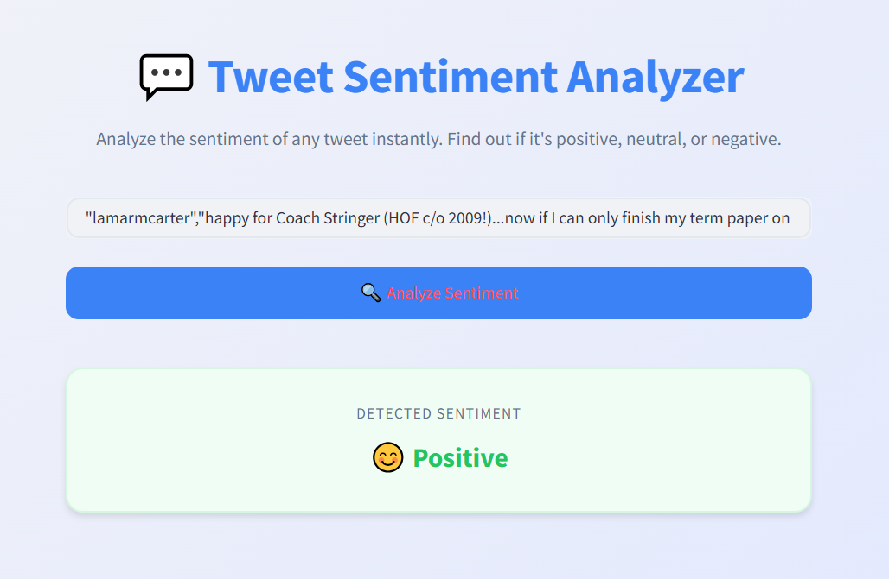
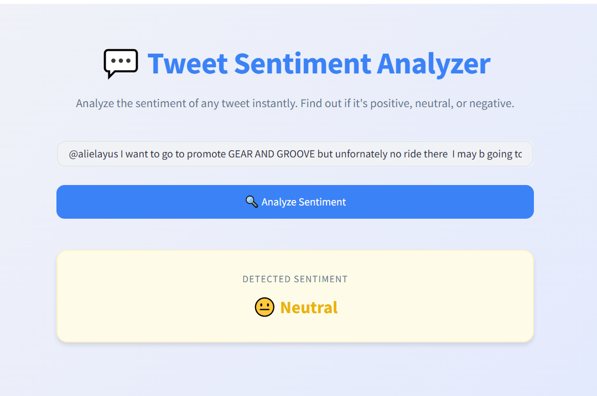
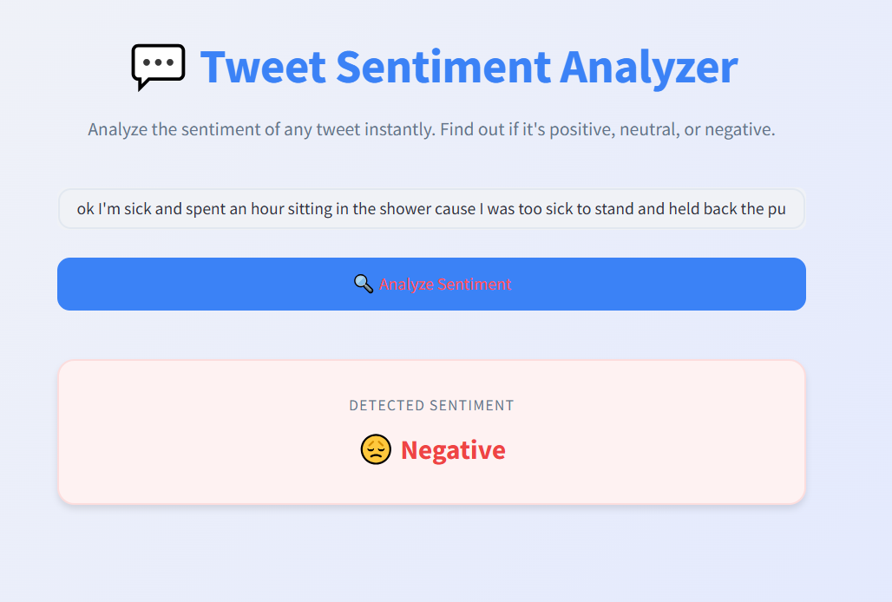

# Tweet Sentiment Analysis

[](https://www.python.org/)
[](https://streamlit.io/)
[](https://fastapi.tiangolo.com/)
[](https://www.docker.com/)

Production-ready sentiment analysis system for tweets using the `cardiffnlp/twitter-xlm-roberta-base-sentiment` model. Features dual deployment options with FastAPI REST API and Streamlit web interface.

---

## Model Architecture

**Base Model:** XLM-RoBERTa Base  
**Task:** Multi-class Text Classification  
**Training:** Fine-tuned on Twitter sentiment data  
**Optimization:** Multilingual support with English optimization

**Classification Schema:**

| Label | Sentiment | Description |
|-------|-----------|-------------|
| 0     | Negative  | Critical feedback, complaints, dissatisfaction |
| 1     | Neutral   | Factual statements, questions, informational content |
| 2     | Positive  | Praise, recommendations, satisfaction |

---

## Demo

### Positive Sentiment
<p align="center">
  
</p>

### Neutral Sentiment
<p align="center">
  
</p>

### Negative Sentiment
<p align="center">
  
</p>

---

## Technical Features

- **Preprocessing Pipeline:** URL removal, mention normalization, special character handling, text normalization
- **API Security:** Password-based authentication with environment variable configuration
- **Dual Interface:** RESTful API for integration, Streamlit UI for interactive testing
- **Container Support:** Docker and Docker Compose ready
- **Architecture:** Clean separation of concerns with services, routes, and utilities layers

---

## Installation

Clone the repository and set up environment:

```bash
git clone https://github.com/haneenfadi/tweet-sentiment-analysis.git
cd tweet-sentiment-analysis
```

### Local Development

```bash
python -m venv venv
source venv/bin/activate  # Windows: venv\Scripts\activate
pip install -r requirements.txt
```

### Docker Deployment

```bash
docker-compose up --build
```

### Environment Configuration

```bash
cp src/.env.example .env
```

Edit `.env`:
```env
API_AUTH_PASSWORD=your_secure_password_here
```

---

## Usage

### Streamlit Interface

```bash
streamlit run src/app/streamlit_app.py
```

Access at `http://localhost:8501`

### FastAPI Endpoint

```bash
uvicorn src.app.api:app 
```

API available at `http://localhost:8000`  
Interactive documentation: `http://localhost:8000/docs`

**Request Example:**

```bash
curl -X POST "http://localhost:8000/api/v1/sentiment/predict" \
  -H "Content-Type: application/json" \
  -H "API_AUTH_PASSWORD: your_secure_password_here" \
  -d '{
    "text": "@switchfoot http://twitpic.com/2y1zl - Awww, that'\''s a bummer. You shoulda got David Carr of Third Day to do it. ;D"
  }'
```

**Response:**
```json
{
  "text": "@switchfoot http://twitpic.com/2y1zl - Awww, that's a bummer. You shoulda got David Carr of Third Day to do it. ;D",
  "sentiment": "Negative"
}
```

---

## Project Structure

```
tweet-sentiment-analysis/
├── Dockerfile                   # Container definition
├── docker-compose.yml           # Orchestration configuration
├── requirements.txt             # Python dependencies
├── .env.example                 # Environment template
└── src/
    ├── app/
    │   ├── api.py               # FastAPI application
    │   └── streamlit_app.py     # Streamlit interface
    ├── services/
    │   ├── pipeline.py          # Prediction orchestration
    │   ├── preprocessing.py     # Text preprocessing
    │   └── tweets_analysis.py   # Model inference
    ├── utils/
    │   ├── config.py            # Configuration management
    │   └── schemas.py           # Pydantic models
    ├── routes/
    │   ├── base.py              # Base routing
    │   └── predict.py           # Prediction endpoints
    └── data/
        └── tweets.csv           # Sample dataset
```

---

## Dataset

Preprocessing pipeline designed for the [Twitter Sentiment Analysis Dataset](https://www.kaggle.com/datasets/raj713335/twittesentimentanalysis/data) from Kaggle.

---

## Security

- Environment variables stored in `.env` (excluded from version control)
- API authentication required for all prediction endpoints
- Strong password requirements for production deployment
- Regular dependency updates recommended

---

## Author

**Haneen Fadi**  
GitHub: [@haneenfadi](https://github.com/haneenfadi)  
Email: haneenqutishat03@gmail.com

---
